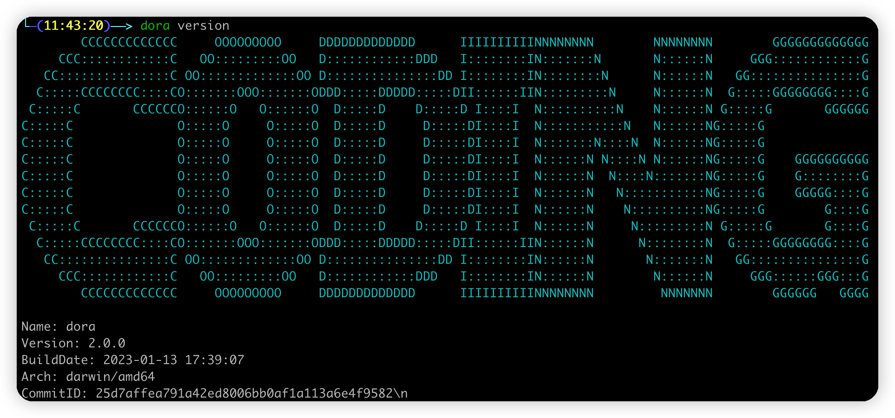
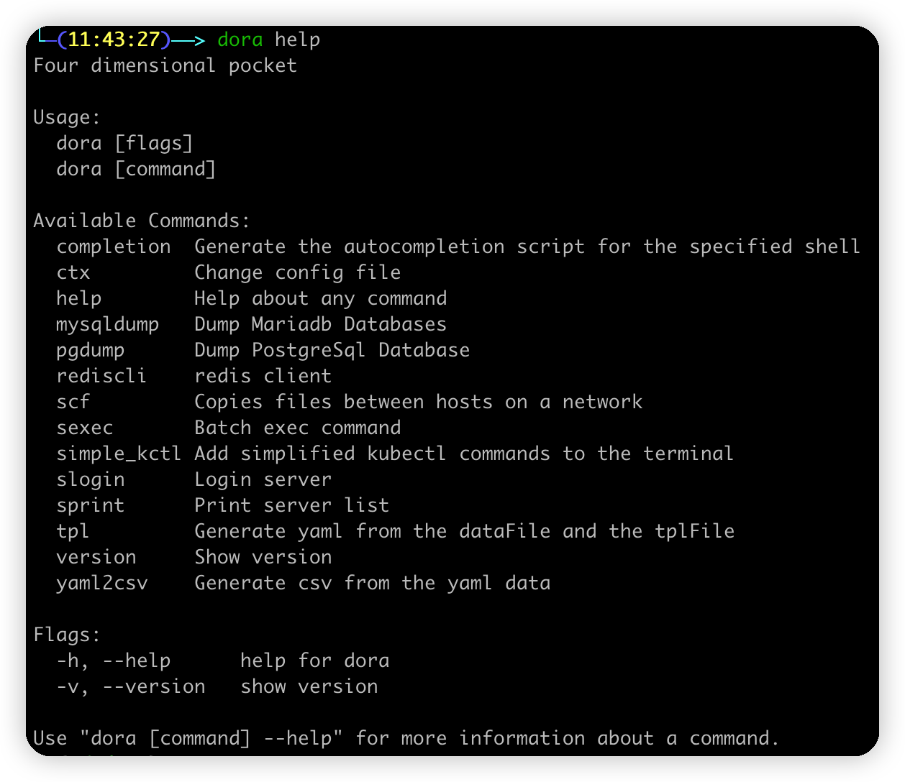
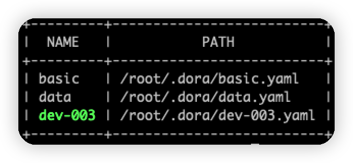
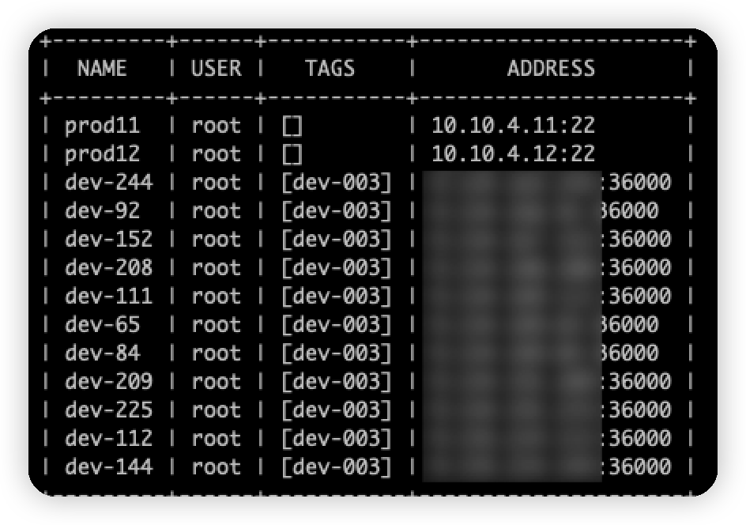
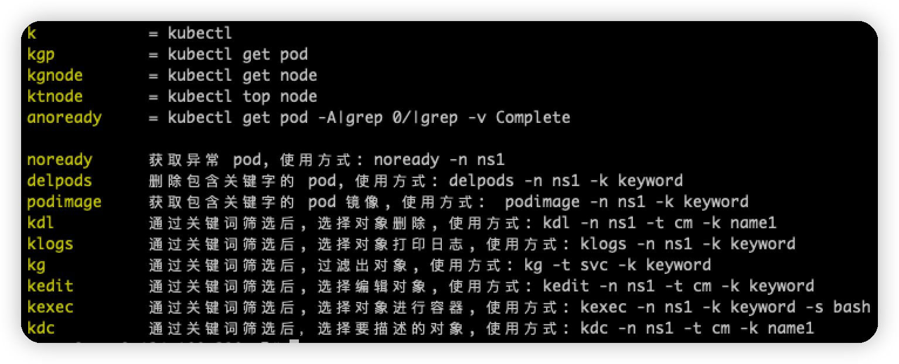

# Dora 使用

## 一、基本介绍

类似多宝箱设计，涵盖了远程服务器操作，Paas 操作，kubectl 简化运维操作，以及本人的使用习惯

### 版本信息

```bash
dora version
```



### 查看 help

```bash
dora help
```



# 二、安装

```
git clone git@gitee.com:chen_dushi_admin/doraemon.git
cd doraemon
sh .cross_compile.sh install
dora
```

# 三、远程服务器功能

## 配置

进到配置目录

```bash
cd ~/.dora
# 查看是否存在一下两个文件 data.yaml、servers.tpl
ls 
```

填写服务器信息

```bash
vim data.yaml
```

```yaml
servers:
  # 名字前缀, 后缀是 ip 的最后一个字段
  namePrefix: dev-
  # 多个 host 的 ip
  host:
    - 1.1.1.1
    - 2.2.2.2
  # 通用的 ssh 端口
  port: 36000
  # 标签
  tag:
    - dev
  # 通用的账密
  user: root
  password: root123
```

渲染生成配置，-o 指定输出的配置文件名

```bash
dora tpl -d data.yaml -t servers.tpl -o test.yaml
```

查看生成的配置文件

```bash
cat test.yaml
```

```yaml
servers:
# 服务器名称
- name: dev-1
  # 服务器地址
  address: 1.1.1.1
  # 服务器端口
  port: 36000
  # 服务器 tag 列表
  tags:
  - dev
   # 登录用户
  user: root
  # 登录密码
  password: C0ding@2022!
  # 登录私钥
  private_key: ""
  # 如果私钥需要密码则在此填写私钥密码
  private_key_password: ""
  # 连接此服务器需要预先连接的服务器(跳板机)
  proxy:
  # 每隔 n 时间发送心跳包保证 ssh 不会自动断开
  server_alive_interval: 20s
  ########### 以下部分为高级配置，具体请阅读后面的高级应用章节 ###########
  # hook_cmd 用于在登录后 hook 远端输入，以实现自动化
  hook_cmd:
  # 配合 hook_cmd 可以读取远端输出
  hook_stdout: true
  # ssh 认证的键盘挑战 hook 脚本，用户可自行扩展实现键盘挑战登录
  keyboard_auth_cmd:
  # ssh 连接成功后注入 session 环境变量(需要 server sshd 调整配置)
  environment:
    ENABLE_VIM_CONFIG: "true"
    Other_KEY: "Other_String_Value"
  # 开启本地 API 支持，开启后可通过远端调用本地 api
  enable_api: true
# 服务器名称
- name: dev-2
  # 服务器地址
  address: 2.2.2.2
  # 服务器端口
  port: 36000
  # 服务器 tag 列表
  tags:
  - dev
   # 登录用户
  user: root
  # 登录密码
  password: C0ding@2022!
  # 登录私钥
  private_key: ""
  # 如果私钥需要密码则在此填写私钥密码
  private_key_password: ""
  # 连接此服务器需要预先连接的服务器(跳板机)
  proxy:
  # 每隔 n 时间发送心跳包保证 ssh 不会自动断开
  server_alive_interval: 20s
  ########### 以下部分为高级配置，具体请阅读后面的高级应用章节 ###########
  # hook_cmd 用于在登录后 hook 远端输入，以实现自动化
  hook_cmd:
  # 配合 hook_cmd 可以读取远端输出
  hook_stdout: true
  # ssh 认证的键盘挑战 hook 脚本，用户可自行扩展实现键盘挑战登录
  keyboard_auth_cmd:
  # ssh 连接成功后注入 session 环境变量(需要 server sshd 调整配置)
  environment:
    ENABLE_VIM_CONFIG: "true"
    Other_KEY: "Other_String_Value"
  # 开启本地 API 支持，开启后可通过远端调用本地 api
  enable_api: true
```

## 配置域上下文切换

查看所有配置域和当前使用的配置域

```bash
dora ctx
```



切换配置域

```bash
dora ctx data
```

## 查看当前域的服务器信息

```bash
dora sprint
```



## 登录服务器

```bash
dora slogin [name] # name 为上面 dora sprint 那一列的信息
```

## 远程执行命令

单台远程执行命令

```bash
dora sexec [name] -c [command]
```

多台远程执行

```bash
dora sexec -t [tag] -c [command] 
```

## 远程文件拷贝

本地拷贝到单台远端

```bash
dora scf [文件1] [文件2] [文件3] [name]:[path]
```

本地拷贝到多台远端

```bash
dora scf [文件1] [文件2] [文件3] -t [name]:[path]
```

远端拷贝到本地

```bash
dora scf [name]:[path] [local path]
```

# 四、kubectl 简化命令

## 安装

```bash
dora simple_kctl
```

## 查看使用说明

```bash
 k_help
```



# 五、Paas 层操作

## mysql 数据库备份

```bash
dora mysqldump -H mysql_host -P [db_port] -u [db_user] -p [db_password] [db_name1] [db_name2] [db_name3] -o [dump_path]
```

## pgdump 备份

```bash
dora pgdump -H [pg_host] -P [pg_port] -u [pg_user] -p [pg_password] -d [db_name] -o [dump_path]
```

## redis 客户端

```bash
dora rediscli -H [redis_host] -P [redis_port]
```

# 六、tpl 文件渲染

```bash
dora tpl -d [数据文件, json 或 yaml 格式] -t [模板文件] -o [输出文件名]
```


